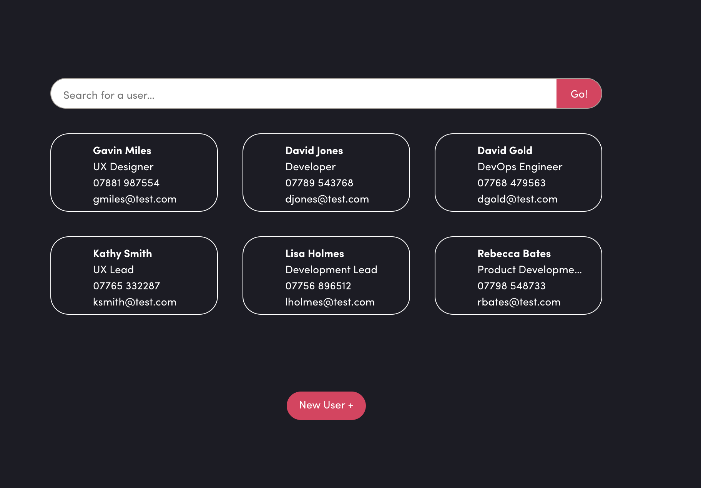

# People Directory UI



## Key Features
- State Management: Powered by NgRx, utilizing a centralized store for user data, search states, and selection logic.

- Internationalization (i18n): Support for English and French (EN/FR) localized strings.

- Smart Search: Real-time filtering with results provided by the .NET backend.

- Business Logic:

  - Prevention of duplicate user selection.

  - Validation against existing emails in the JSON 'DB'.

  - Reactive UI updates based on store state.

This project was generated using [Angular CLI](https://github.com/angular/angular-cli) version 21.1.3.

## Tech Stack
- Framework: Angular 21
- State: NgRx (Store, Effects, Selectors)
- Testing: Vitest (Unit)

## Development server

To start a local development server, run:

```bash
ng serve
```

Once the server is running, open your browser and navigate to `http://localhost:4200/`. The application will automatically reload whenever you modify any of the source files.

## Building

To build the project run:

```bash
ng build
```

This will compile your project and store the build artifacts in the `dist/` directory. By default, the production build optimizes your application for performance and speed.

## Running unit tests

To execute unit tests with the [Vitest](https://vitest.dev/) test runner, use the following command:

```bash
ng test
```

Angular CLI does not come with an end-to-end testing framework by default. You can choose one that suits your needs.
